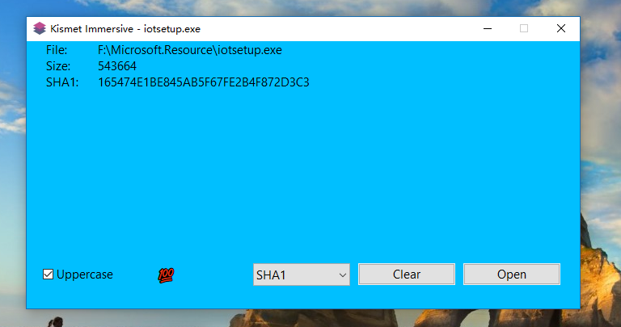

# Kismet File Hashsum

## MD5

## SHA1 Collision Detection

## Complete

## Theme 

Your can select system menu, click Theme, change your Panel Color, or modify Kismet.exe.ini,
change Content color, and set your title

Your can fill include content and panel use one color

WORKING IN PROGRESS