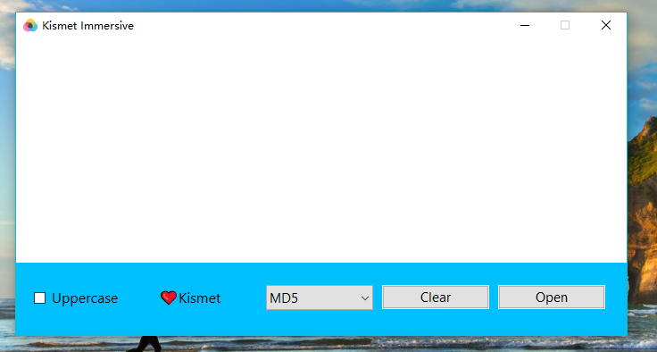
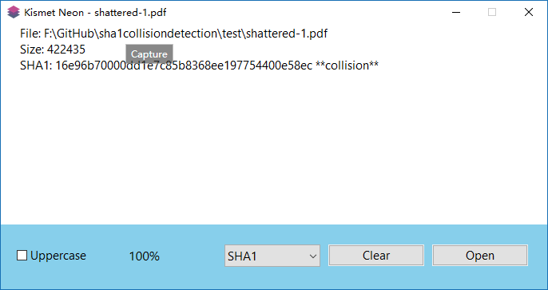
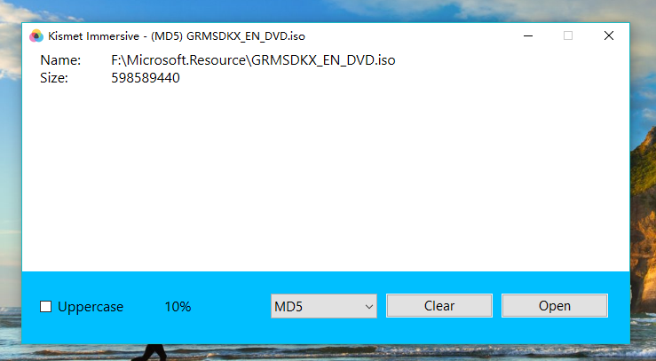
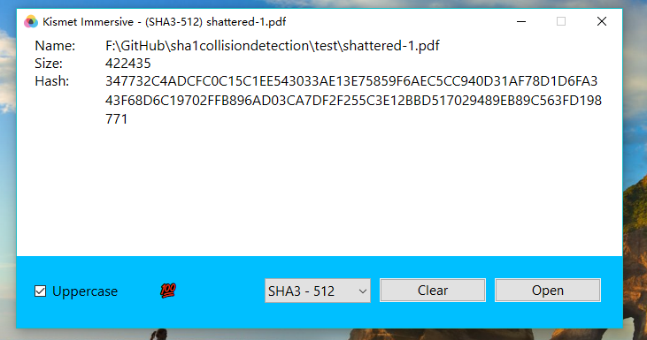
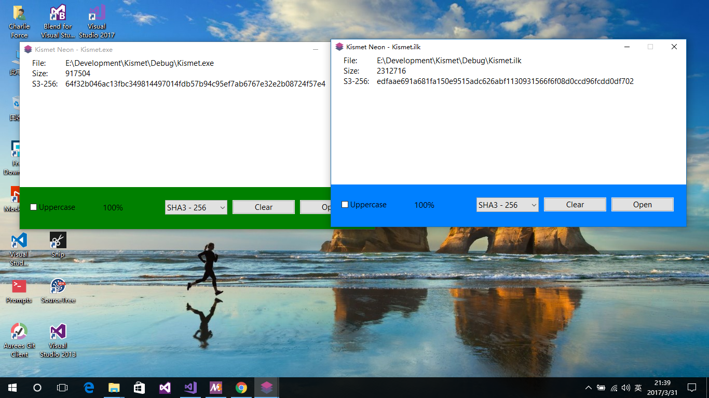

# Kismet File Hashsum

## None

## MD5

## SHA1 Collision Detection

## Progress

## Complete

## SHA3-512

## Theme 

Your can select system menu, click Theme, change your Panel Color, or modify Kismet.exe.ini,
change Content color, and set your title

You can use a color that fills the entire window

WORKING IN PROGRESS